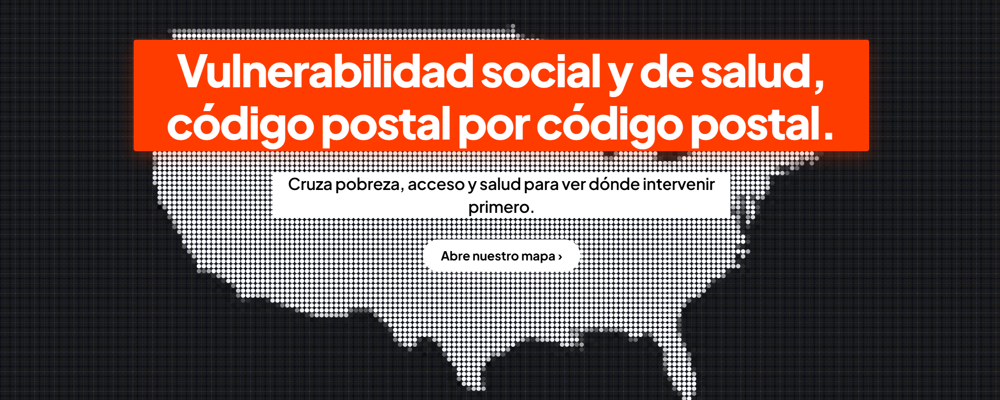
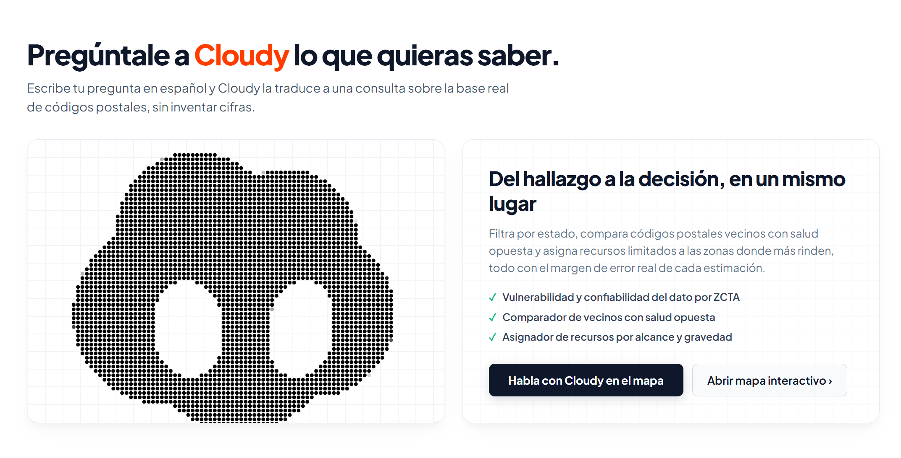
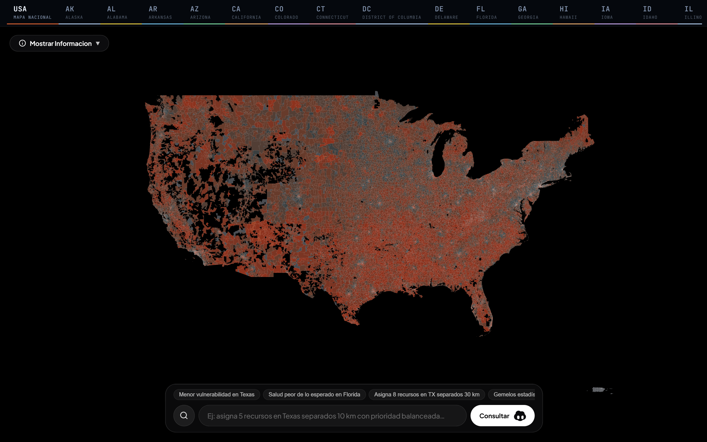
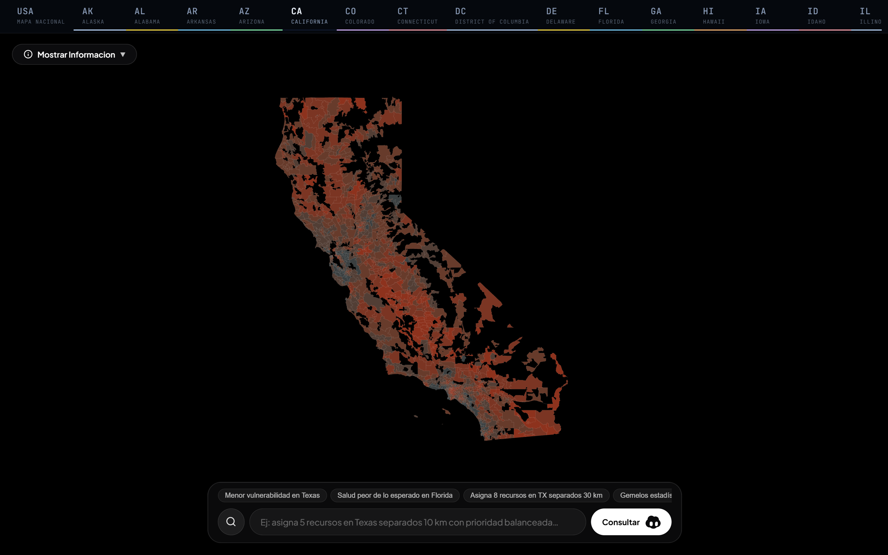
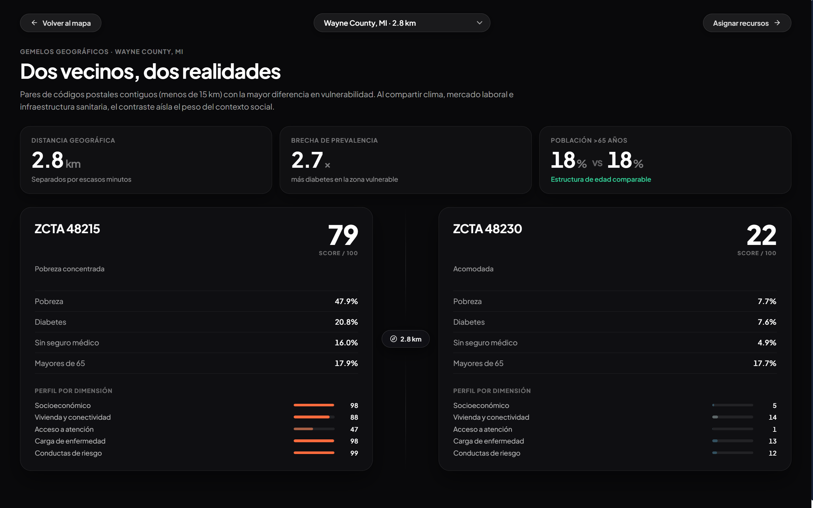

# CareMap (DataRush 2026)

<p align="center">
  
</p>

<p align="center">
  <strong>Plataforma geoespacial de inteligencia en salud pública para EE.UU.</strong>
  <br>
  Transformando datos sociodemográficos y de salud en decisiones accionables a nivel ZCTA.
</p>

<p align="center">
  
  
  
  
  
  
</p>

<p align="center">
  
</p>

---

## 📹 Video Demo

[**▶ Ver video pitch en Google Drive**](https://drive.google.com/file/d/11GQHL0eGe9FsgEzhc4RI7U5ZWXUv4fDb/view?usp=sharing)

El video también está incluido en el repositorio: [`VIDEO_CAREMAP.mp4`](VIDEO_CAREMAP.mp4)

**Idioma:** Español

> 💡 **Nota:** El video incluye la demostración de la arquitectura interactiva, el algoritmo de asignación, la comparativa de gemelos estadísticos y nuestro agente de IA "Cloudy".

---

## 📋 Tabla de Contenidos

- [Resumen Ejecutivo](#-resumen-ejecutivo)
- [Problema y Solución](#-problema-y-solución)
- [Arquitectura Técnica](#️-arquitectura-técnica)
- [Herramientas Tecnológicas](#-herramientas-tecnológicas)
- [Características Principales](#-características-principales)
- [Casos de Uso](#-casos-de-uso)
- [Equipo](#-equipo)

---

## 🎯 Resumen Ejecutivo

**CareMap** es una herramienta (dashboard) y un índice compuesto de vulnerabilidad sociosanitaria por ZCTA (código postal aproximado) que permite a tomadores de decisiones en EE.UU. asignar recursos de salud de manera equitativa e informada. 

✅ **Índice robusto** que considera el margen de error (MOE) y no confunde ruido con vulnerabilidad real.  
✅ **Geográficamente navegable** a nivel ZCTA, condado y estado.  
✅ **Algoritmo de asignación** de recursos que maximiza el impacto poblacional.  
✅ **Asistente de Inteligencia Artificial (Cloudy)** con Text-to-SQL y RAG (Retrieval-Augmented Generation) para interactuar con los datos usando lenguaje natural.  
✅ **Análisis de Gemelos Estadísticos** para comparar intervenciones en comunidades demográficamente idénticas.

---

## 🔍 Problema y Solución

### 🚨 El Problema
En EE.UU., los datos de **contexto social** (quién vive en cada código postal) y de **salud** (qué tan enferma está esa población) viven en silos separados. Los tomadores de decisiones gubernamentales y ONGs suelen decidir dónde poner clínicas o programas a ciegas, basándose en promedios de condado que esconden graves desigualdades intraciudad. 

Además, **el margen de error (MOE)** en zonas de baja población es masivo; usar estos datos sin tratamiento estadístico lleva a asignar presupuesto basándose en "ruido" en lugar de vulnerabilidad real.

### 💡 Nuestra Solución
Una plataforma interactiva que:
- Integra y limpia los datos de SDOH (Social Determinants of Health) y CDC PLACES.
- Visibiliza la **verdadera vulnerabilidad** controlando la incertidumbre del MOE.
- Explica **qué causa la vulnerabilidad** en cada zona específica (no solo *dónde* está mal).
- Sugiere la mejor distribución de recursos limitados (unidades móviles, clínicas) equilibrando gravedad y alcance poblacional.

---

## 🏗️ Arquitectura Técnica

CareMap sustituye infraestructuras complejas en la nube con un enfoque moderno, serverless y ágil basado en **InsForge** y el ecosistema frontend de Vite.

### 🔧 Componentes Implementados

#### 1. **InsForge (BaaS Postgres-based)**
- **Base de Datos Relacional:** PostgreSQL aloja la tabla `zcta_analytics` con 31,742 registros de áreas consolidadas.
- **Acceso API y Seguridad:** Consultas HTTP directas a través del SDK de InsForge para recuperar datos de mapas y ejecutar consultas generadas por IA.
- **Roles y Políticas:** Row-Level Security y tokens JWT garantizan el acceso únicamente de lectura a la base de analítica.

#### 2. **AI & Agente "Cloudy" (RAG y Text-to-SQL)**
- **OpenRouter & LLMs:** El asistente IA genera dinámicamente consultas SQL a partir de las solicitudes del usuario en lenguaje natural.
- **RAG Pattern:** Al LLM se le inyecta como contexto el esquema relacional (`DATABASE_SCHEMA`) y las métricas disponibles. Esto le permite responder preguntas como *"¿Cuáles son las zonas con salud peor de lo esperado en Texas?"*.
- **Intent Recognition:** En lugar de parsers rígidos, el modelo analiza intenciones (ej. solicitudes de *asignación de recursos*) y extrae JSON estructurado para alimentar el algoritmo de distribución matemática en el frontend.

#### 3. **Frontend SPA (Single Page Application)**
- Arquitectura 100% estática servida globalmente desde **Vercel** Edge Network.
- Los polígonos del mapa y geometrías topológicas se pre-cargan y dibujan mediante WebGL (Deck.gl) logrando +60fps sin saturar la red.

### 📊 Flujo de Datos
```
Usuario → Frontend (React + Vite) ↔ Vercel Edge Network
            ↓ (Prompt Natural)
    LLM OpenRouter (Cloudy Agent) → Convierte Texto a SQL/JSON
            ↓ (SQL Query)
       InsForge (PostgreSQL) → Devuelve Resultados Analíticos
            ↓ 
    Renderizado WebGL (Deck.gl) / Ejecución de Algoritmo Asignador
```

---

## 🛠 Herramientas Tecnológicas

### Frontend Stack
- **React 19 & TypeScript:** Tipado estricto y componentes funcionales.
- **Vite:** Build tool ultra-rápido.
- **Deck.gl & TopoJSON:** Renderizado masivo de polígonos geoespaciales por GPU, soportando el trazado de miles de ZCTAs en tiempo real.
- **React Router:** SPA routing.
- **Vercel:** Despliegue, CDN global y fallback SPA.

### Backend & AI Stack
- **InsForge:** Backend unificado con PostgreSQL.
- **Python (ETL):** Scripts locales de unificación (`etl_zcta_unify.py`) que procesan ACS y CDC PLACES antes de subirlos a la DB.
- **OpenRouter API:** Interfaz con Llama de Meta para la inteligencia de Cloudy.

---

## ✨ Características Principales

### Cloudy 
<p align="center">
  
</p>

**Cloudy** no es un chatbot tradicional; es un agente RAG geoespacial capaz de transformar preguntas como: *"Mayor prevalencia de diabetes en California"* en sentencias de PostgreSQL seguras, ejecutarlas en **InsForge**, y resaltar visualmente los ZCTAs resultantes en el mapa. 

### Mapa Analítico ZCTA (Vista Nacional y Estatal)
<p align="center">
  
  <br><i>Vista nacional mostrando el índice de vulnerabilidad a lo largo del país.</i>
</p>
<p align="center">
  
  <br><i>Vista estatal detallada, donde puedes explorar y visualizar el código postal específico de cada zona en el estado seleccionado.</i>
</p>

Renderizado de alta eficiencia de todo el país a nivel ZCTA.
- Desglose por factores causales (Socioeconómico, Vivienda, Carga de Enfermedad, etc.).
- Filtrado por estados y cálculo de penalización estadística para ZCTAs ruidosos o de baja población.

### 3. 🎯 Asignador de Recursos Inteligente
*Caso:* Un director de salud tiene presupuesto para 5 brigadas en un estado. 
Si elige solo las zonas más "graves", podría terminar sirviendo a códigos postales de 100 habitantes. El **Algoritmo de Asignación** permite al usuario nivelar un *slider* entre **Gravedad vs. Alcance Poblacional**, y separa geográficamente las unidades sugeridas para evitar redundancia espacial.

### 4. 👯‍♂️ Gemelos Estadísticos
<p align="center">
  
</p>

Al seleccionar un ZCTA, el sistema encuentra su "gemelo estadístico" en cualquier otra parte del país (usando distancia euclidiana en el hiperespacio de los factores sociodemográficos). Útil para extrapolar intervenciones de salud exitosas de una zona a otra zona idéntica pero en distinto estado.

---

## 🎬 Casos de Uso

**Escenario: Asignación de Unidades Móviles (Texas)**
1. El usuario abre CareMap e invoca a Cloudy: *"Asigna 8 unidades móviles en Texas priorizando el alcance"*.
2. Cloudy procesa el *Intent* y estructura un JSON con: `recursos: 8, estado: TX, balance: 1`.
3. El frontend corre el algoritmo de optimización y encuentra la distribución perfecta.
4. En contraste con elegir a mano las peores zonas (alcance de ~199k personas), el algoritmo de CareMap optimiza el posicionamiento llegando a **632,397 personas**, multiplicando por 3.2 el alcance con el mismo presupuesto.

---

## 👥 Equipo

| Rol | Nombre | Contribución | LinkedIn |
|-----|--------|--------------|----------|
| **Full Stack Developer** | Roberto Ochoa Cuevas | Arquitectura, Data Pipelines (Python), Algoritmos Analíticos, Video Pitch (Hyperframe), Diseño UI/UX | [LinkedIn](https://www.linkedin.com/in/roberto-ochoa-cuevas-9082a129b) |
| **Full Stack Developer** | Aldo Karim Garcia Zapata | Integración con InsForge, Creación del agente de IA, React, Vite, Mapas (Deck.gl), Vercel Deploy | [LinkedIn](https://www.linkedin.com/in/aldo-karim-2178072b7) |

---

<p align="center">
  <strong>Desarrollado con ❤️</strong>
  <br>
  <sub>Data Rush 2026 | Data Science Club at Tec</sub>
</p>
